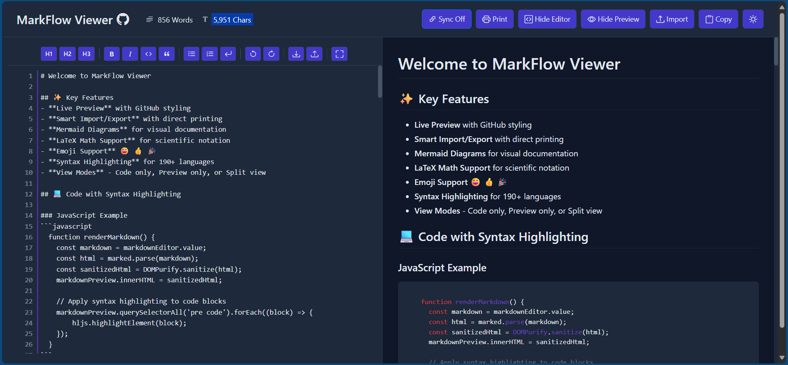
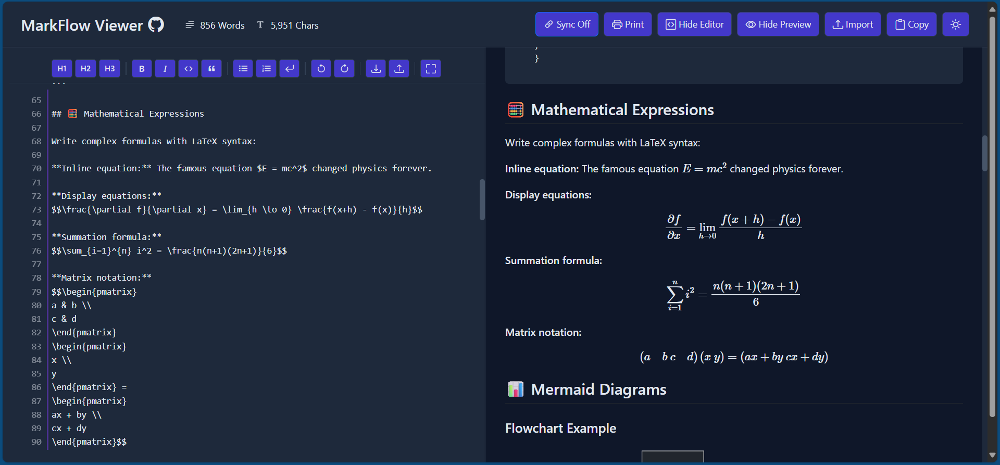
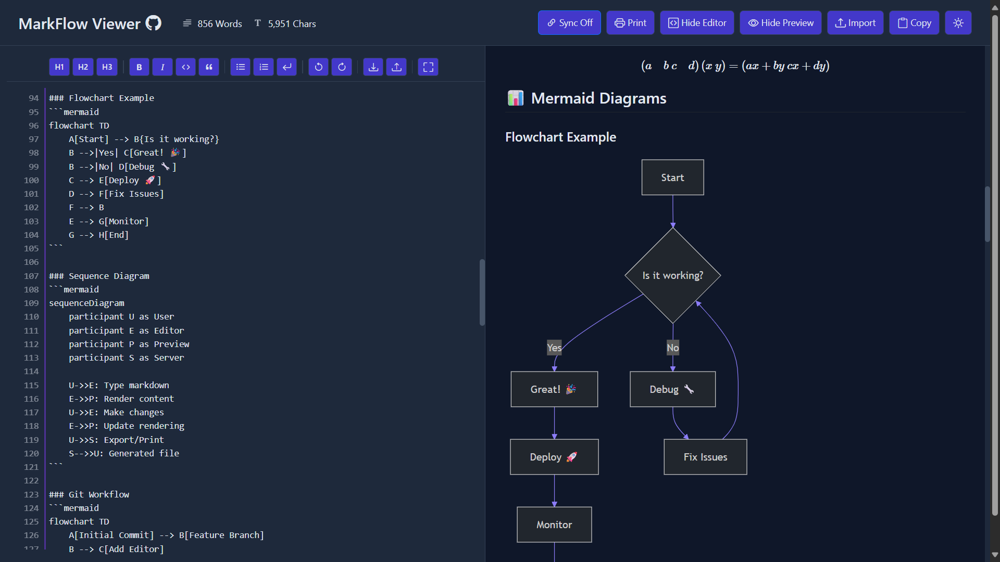

# MarkFlow Viewer

**Your Markdown, Elevated: Write, Preview, and Perfect.**

## 🚀 Overview

MarkFlow Viewer is a powerful, feature-rich, and beautifully redesigned GitHub-style Markdown editor and live previewer. It operates entirely client-side, ensuring your data remains private and secure. This project builds upon and significantly enhances the foundational work of the original [Markdown-Viewer by ThisIs-Developer](https://github.com/ThisIs-Developer/Markdown-Viewer/).

Our goal was to take a fantastic concept and elevate it with a more polished user interface, a stunning new Purple x Blue dark theme, an improved light theme, and numerous under-the-hood enhancements for a smoother, more professional experience.

## ✨ Key Features

| Feature                        | Description                                                                           |
| :----------------------------- | :------------------------------------------------------------------------------------ |
| **Live Preview**               | Instant, GitHub-style rendering of your Markdown as you type.                         |
| **Stunning Themes**            | Includes a custom Purple x Blue Dark Mode and an improved Light Mode.                 |
| **Syntax Highlighting**        | Supports a wide array of languages (including Batch files).                           |
| **LaTeX Math Support**         | Seamlessly render mathematical equations and formulas using MathJax.                  |
| **Mermaid Diagrams**           | Create and embed flowcharts, sequence diagrams, etc., directly in Markdown.           |
| **Emoji Support**              | Convert shortcodes like `:smile:` into vibrant emojis.                                |
| **Formatting Toolbar**       | Easy access to headings, bold, italics, lists, code blocks, quotes, etc.            |
| **File Operations**            | Import .md files (drag & drop/browse); Export as .md, HTML, or Print output.        |
| **View Controls**              | Toggle editor/preview visibility (Code, Preview, Both); Fullscreen mode.            |
| **Editor Enhancements**        | Line numbers, Undo/Redo, Synchronized scrolling (toggleable, on by default).          |
| **Content Statistics**         | Real-time word and character counts.                                                  |
| **Fully Responsive**           | Adapts beautifully to desktop, tablet, and mobile screens.                            |
| **100% Client-Side**           | All processing happens in your browser; no data sent to any server.                   |
| **No Sign-Up Required**        | Use instantly.                                                                        |

## 📸 Screenshots

### Code Syntax Highlighting Example

### LaTeX Math Rendering

### Mermaid Diagram Example

## 📝 Usage

1.  **Write**: Type or paste your Markdown into the left-hand editor pane.
2.  **Preview**: See the live, rendered HTML output in the right-hand preview pane.
3.  **Import**: Click the "Import" button or drag and drop a `.md` file onto the designated dropzone.
4.  **Export/Print**: Use the "Print" button for a print-optimized output or the "Download" icon in the formatting toolbar to save as Markdown or HTML.
5.  **Toggle Themes**: Click the theme toggle icon (moon/sun) in the main toolbar to switch between light and dark modes.
6.  **View Modes**: Use the "Hide Editor" / "Hide Preview" buttons to cycle through different layout views.

## 🛠️ Technologies Used

| Category             | Technologies                                                              |
| :------------------- | :------------------------------------------------------------------------ |
| **Core**             | HTML5, CSS3 (CSS Variables), Vanilla JavaScript                           |
| **Framework/UI**     | Bootstrap                                                                 |
| **Markdown & Parsing** | Marked.js, DOMPurify (Sanitization)                                       |
| **Enhancements**     | Highlight.js (Syntax Highlighting), MathJax, Mermaid.js, JoyPixels (Emoji) |
| **File Handling**    | FileSaver.js                                                              |

## 🙏 Acknowledgments & Inspiration

This project, MarkFlow Viewer, stands on the shoulders of giants. **It was heavily inspired by and evolved from the original [Markdown-Viewer by @ThisIs-Developer](https://github.com/ThisIs-Developer/Markdown-Viewer/).**

We've taken much of the core idea, initial design inspiration, and feature set from their incredible work. Many of the upgrades, the new visual themes, and feature enhancements in this version were built directly upon or as an evolution of their initial design.

**Frankly, without @ThisIs-Developer's original repository, this enhanced version wouldn't have been possible.** We are immensely grateful for their contribution to the open-source community and for providing such a solid foundation to build upon. We encourage you to check out their original project!

## 📄 License

This project is licensed under the Apache-2.0 License. Please see the `LICENSE` file that should be included with this project (or refer to the original repository: [https://github.com/ThisIs-Developer/Markdown-Viewer/blob/main/LICENSE](https://github.com/ThisIs-Developer/Markdown-Viewer/blob/main/LICENSE)) for full license details.

---

Developed by Zig Zag 