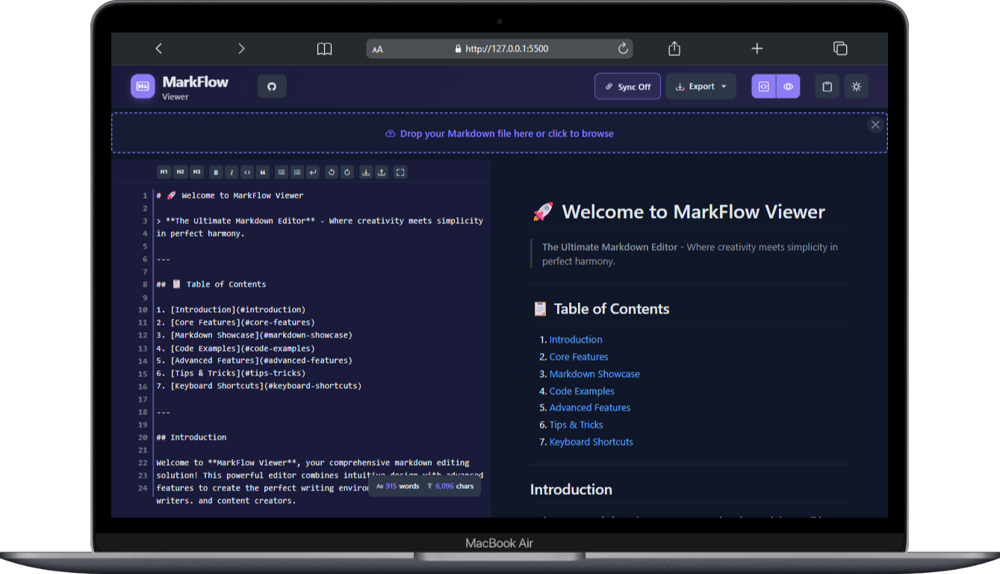
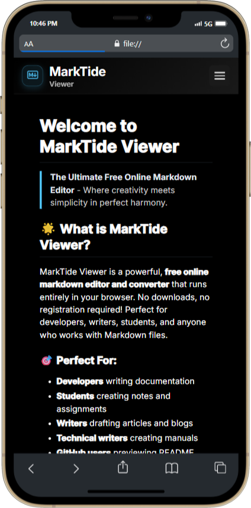

# 🚀 MarkFlow Viewer - Free Online Markdown Editor & Converter

[](https://zigzag-007.github.io/MarkFlow-Viewer/)
[](https://github.com/zigzag-007/MarkFlow-Viewer/stargazers)
[](https://github.com/zigzag-007/MarkFlow-Viewer/blob/main/LICENSE)

> **The Ultimate Free Online Markdown Editor** - Convert Markdown to PDF, HTML, and Text with Real-time Preview

## 🌟 What is MarkFlow Viewer?

MarkFlow Viewer is a powerful, **free online markdown editor and converter** that runs entirely in your browser. No downloads, no registration required! Perfect for developers, writers, students, and anyone who works with Markdown files.

### 🎯 Perfect For:
- **Developers** writing documentation
- **Students** creating notes and assignments  
- **Writers** drafting articles and blogs
- **Technical writers** creating manuals
- **GitHub users** previewing README files
- **Anyone** who needs to convert Markdown to PDF or HTML

## ✨ Key Features

### 📝 **Markdown Editor**
- Real-time live preview
- Syntax highlighting with 190+ programming languages
- Line numbers and formatting toolbar
- Drag & drop file support
- Auto-save functionality

### 🔄 **Format Conversion**
- **Markdown to PDF** - Professional document export
- **Markdown to HTML** - Web-ready conversion  
- **Markdown to Text** - Plain text extraction
- **GitHub-flavored Markdown** support

### 🎨 **User Experience**
- Beautiful dark & light themes
- Responsive design (works on mobile, tablet, desktop)
- Split-screen editor and preview
- Scroll synchronization
- Keyboard shortcuts for power users

### 🚀 **Advanced Features**
- Mermaid diagram support
- Mathematical expressions (LaTeX)
- Tables, task lists, and code blocks
- Emoji support
- Print-friendly layouts

## 🚀 Quick Start

1. **Visit**: [https://zigzag-007.github.io/MarkFlow-Viewer/](https://zigzag-007.github.io/MarkFlow-Viewer/)
2. **Start typing** or **drag & drop** your `.md` file
3. **See live preview** in real-time
4. **Export** to PDF, HTML, or Text when ready

No installation needed - works instantly in any modern web browser!

## 🎯 Use Cases

### For Developers
```markdown
# Project Documentation
- API documentation
- README files
- Code documentation
- Technical specifications
```

### For Students & Academics
```markdown
# Academic Work
- Research papers
- Study notes  
- Assignment reports
- Thesis drafts
```

### For Content Creators
```markdown
# Content Creation
- Blog posts
- Articles
- Documentation
- User manuals
```

## 🛠️ Technology Stack

- **Frontend**: Vanilla JavaScript, HTML5, CSS3
- **Markdown Processing**: Marked.js
- **Syntax Highlighting**: Highlight.js
- **PDF Generation**: html2pdf.js
- **Math Rendering**: MathJax
- **Diagrams**: Mermaid.js

## 🔧 Local Development

```bash
# Clone the repository
git clone https://github.com/zigzag-007/MarkFlow-Viewer.git

# Navigate to project directory
cd MarkFlow-Viewer

# Open in browser (or use live server)
open index.html
```

## 📱 Browser Support

- ✅ Chrome (recommended)
- ✅ Firefox
- ✅ Safari
- ✅ Edge
- ✅ Mobile browsers

## 🌟 Why Choose MarkFlow Viewer?

| Feature | MarkFlow Viewer | Other Tools |
|---------|----------------|-------------|
| **Free Forever** | ✅ | ❌ (Most charge) |
| **No Registration** | ✅ | ❌ (Most require signup) |
| **Works Offline** | ✅ | ❌ (Most need internet) |
| **Privacy Focused** | ✅ | ❌ (Most track users) |
| **Open Source** | ✅ | ❌ (Most are closed) |
| **PDF Export** | ✅ | ✅ (Some do) |
| **Real-time Preview** | ✅ | ✅ (Some do) |
| **Mobile Friendly** | ✅ | ❌ (Most desktop only) |

## 🎨 Screenshots

### Desktop Experience


### Mobile Experience  


## 🔍 Keywords

`markdown editor` `markdown converter` `markdown to pdf` `markdown to html` `online markdown` `free markdown editor` `markdown viewer` `md converter` `github markdown` `markdown preview` `web markdown editor` `browser markdown` `markdown online tool`

## 🤝 Contributing

Contributions are welcome! Please feel free to submit a Pull Request.

1. Fork the project
2. Create your feature branch (`git checkout -b feature/AmazingFeature`)
3. Commit your changes (`git commit -m 'Add some AmazingFeature'`)
4. Push to the branch (`git push origin feature/AmazingFeature`)
5. Open a Pull Request

## 📄 License

This project is licensed under the MIT License - see the [LICENSE](LICENSE) file for details.

## 👨‍💻 Author

**Zig Zag** - [GitHub Profile](https://github.com/zigzag-007)

- 🌐 Website: [https://zigzag-007.github.io/MarkFlow-Viewer/](https://zigzag-007.github.io/MarkFlow-Viewer/)
- 📧 Contact: [Dark Net Studio](https://t.me/dark_net_studio)

## ⭐ Support

If you find MarkFlow Viewer helpful, please consider:
- ⭐ **Starring** this repository
- 🐛 **Reporting** any bugs you find
- 💡 **Suggesting** new features
- 🔄 **Sharing** with your network

---

<div align="center">

### 🚀 Try MarkFlow Viewer Now!

**[Launch MarkFlow Viewer →](https://zigzag-007.github.io/MarkFlow-Viewer/)**

*Free • No Registration • Works in Browser*

</div> 