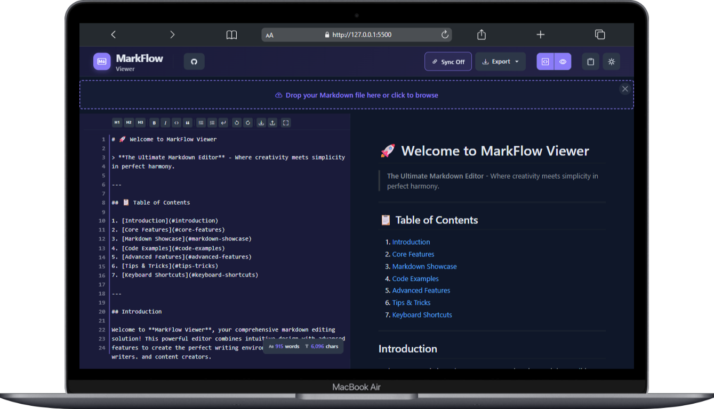
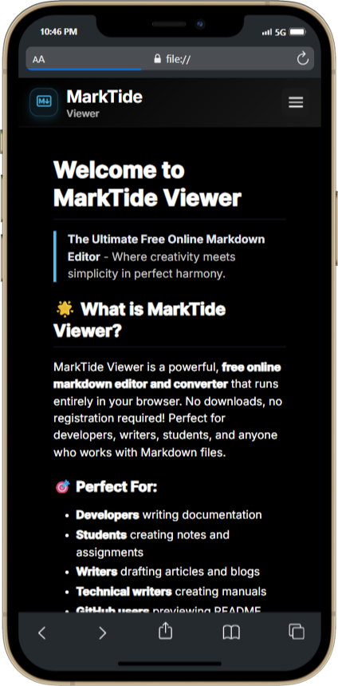

# MarkTide

## The Ultimate Free Online Markdown Editor & Converter

[](https://marktide.netlify.app/)
[](https://github.com/zigzag-007/MarkTide-Viewer/stargazers)
[](https://github.com/zigzag-007/MarkTide-Viewer/blob/main/LICENSE)
[](https://marktide.netlify.app/)
[](https://marktide.netlify.app/)

**Write. Preview. Export. All in your browser. No login. No cost. No limits.**

[🚀 Launch MarkTide](https://marktide.netlify.app/) | [🐛 Report Bug](https://github.com/zigzag-007/MarkTide-Viewer/issues) | [💡 Request Feature](https://github.com/zigzag-007/MarkTide-Viewer/issues)

---

## 📸 Preview

| Desktop                                         | Mobile                                        |
| ----------------------------------------------- | --------------------------------------------- |
|  |  |

---

## ✨ What is MarkTide?

MarkTide is a **powerful, privacy-first Markdown editor** that runs entirely in your browser. No downloads, no accounts, no tracking. Whether you're a developer writing docs, a student drafting notes, or a writer crafting content, MarkTide gives you a clean, fast, and beautiful editing experience with one-click export to PDF, HTML, or plain text.

---

## 🎯 Who Is It For?

|      👨‍💻 Developers       |          🎓 Students          |      ✍️ Writers      | 🛠️ Technical Writers |
| :----------------------: | :---------------------------: | :------------------: | :------------------: |
| API docs, READMEs, specs | Notes, reports, thesis drafts | Blog posts, articles |   Manuals, guides    |

---

## 💡 Key Features

### 📝 Editor

- **Monaco-powered** editor (same engine as VS Code)
- Real-time live preview with scroll sync
- Syntax highlighting for **190+ languages**
- Drag & drop `.md` file support
- Formatting toolbar: bold, italic, code, lists, and more

### 🔄 Export & Conversion

- **Markdown to PDF** - clean, print-ready output
- **Markdown to HTML** - web-ready with styles
- **Markdown to Plain Text** - stripped for any use
- Full **GitHub Flavored Markdown (GFM)** support

### 🎨 Experience & Design

- Beautiful **dark & light themes** with smooth radial transitions
- **Split-screen** editor and preview layout
- Fully **responsive** - works on mobile, tablet, and desktop
- Keyboard shortcuts for power users

### 🚀 Advanced Capabilities

- 📊 **Mermaid diagrams** - flowcharts, sequence diagrams, and more
- 🧮 **LaTeX math expressions** - powered by MathJax
- ✅ Task lists, tables, and fenced code blocks
- 😊 Emoji support
- 🖨️ Print-friendly layouts

---

## ⚡ Quick Start

No installation needed. Open your browser and go:

```text
https://marktide.netlify.app/
```

1. **Type** your Markdown, or **drag & drop** an `.md` file
2. **Preview** updates live in real-time
3. **Export** to PDF, HTML, or Text in one click

---

## 🏆 How MarkTide Compares

| Feature                       | MarkTide |      Other Tools       |
| :---------------------------- | :------: | :--------------------: |
| Free Forever                  |    ✅    |     ❌ Most charge     |
| No Registration               |    ✅    | ❌ Most require signup |
| Privacy Focused (no tracking) |    ✅    |  ❌ Most track users   |
| Open Source                   |    ✅    |   ❌ Most are closed   |
| PDF Export                    |    ✅    |        ✅ Some         |
| Real-time Preview             |    ✅    |        ✅ Some         |
| Mobile Friendly               |    ✅    | ❌ Mostly desktop only |
| Mermaid Diagrams              |    ✅    |       ❌ Rarely        |
| LaTeX Math Support            |    ✅    |       ❌ Rarely        |

---

## 🛠️ Technology Stack

| Layer               | Technology                                                  |
| :------------------ | :---------------------------------------------------------- |
| Frontend            | Vanilla JavaScript, HTML5, CSS3                             |
| Editor Engine       | [Monaco Editor](https://microsoft.github.io/monaco-editor/) |
| Markdown Processing | [Marked.js](https://marked.js.org/)                         |
| Syntax Highlighting | [Highlight.js](https://highlightjs.org/)                    |
| PDF Generation      | [html2pdf.js](https://ekoopmans.github.io/html2pdf.js/)     |
| Math Rendering      | [MathJax](https://www.mathjax.org/)                         |
| Diagrams            | [Mermaid.js](https://mermaid.js.org/)                       |
| Theme Transitions   | View Transitions API + ripple fallback                      |

---

## 🔧 Local Development

```bash
# 1. Clone the repository
git clone https://github.com/zigzag-007/MarkTide-Viewer.git

# 2. Navigate to the project folder
cd MarkTide-Viewer

# 3. Open in browser (or use a live server extension)
open index.html
```

> 💡 **Tip:** For the best development experience, use the [Live Server](https://marketplace.visualstudio.com/items?itemName=ritwickdey.LiveServer) extension in VS Code.

---

## 📱 Browser Support

|     Chrome     | Firefox | Safari | Edge | Mobile |
| :------------: | :-----: | :----: | :--: | :----: |
| ✅ Recommended |   ✅    |   ✅   |  ✅  |   ✅   |

---

## 🤝 Contributing

Contributions, bug reports, and feature requests are all welcome!

1. **Fork** the repository
2. **Create** a feature branch → `git checkout -b feature/YourFeature`
3. **Commit** your changes → `git commit -m 'Add YourFeature'`
4. **Push** to the branch → `git push origin feature/YourFeature`
5. **Open** a Pull Request

Please check the [open issues](https://github.com/zigzag-007/MarkTide-Viewer/issues) before submitting new ones.

---

## 📄 License

This project is licensed under the **MIT License**. See the [LICENSE](https://github.com/zigzag-007/MarkTide-Viewer/blob/main/LICENSE) file for details.

---

## 👨‍💻 Author

**Zig Zag** | [GitHub](https://github.com/zigzag-007) | [MarkTide](https://marktide.netlify.app/)

Built with ❤️ by Dark Net Studio

---

## ⭐ Support the Project

If MarkTide has been useful to you, consider giving it a star. It helps others discover it!

[](https://github.com/zigzag-007/MarkTide-Viewer/stargazers)

> 🐛 Found a bug? [Report it here](https://github.com/zigzag-007/MarkTide-Viewer/issues)
> 💡 Got an idea? [Suggest a feature](https://github.com/zigzag-007/MarkTide-Viewer/issues)

---

Free | Open Source | No Registration | Works in Your Browser

[🚀 Launch MarkTide Now](https://marktide.netlify.app/)
