# 03  Mermaid Diagrams

> **Test Purpose:** Test Mermaid diagram rendering across all major diagram types and edge cases.  
> **What to look for:** Correct diagram rendering, labels visible, no syntax errors shown, proper layout direction.  
> **Note:** Mermaid requires renderer support (e.g., VS Code with Markdown Preview Enhanced, Obsidian, HackMD, GitHub).

---

## 1. Flowchart  Left to Right

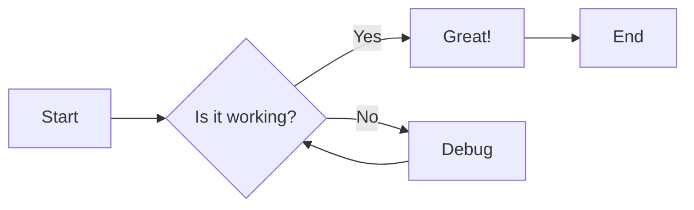
```mermaid
flowchart LR
    A[Start] --> B{Is it working?}
    B -- Yes --> C[Great!]
    B -- No --> D[Debug]
    D --> B
    C --> E[End]
```

---

## 2. Flowchart  Top to Bottom

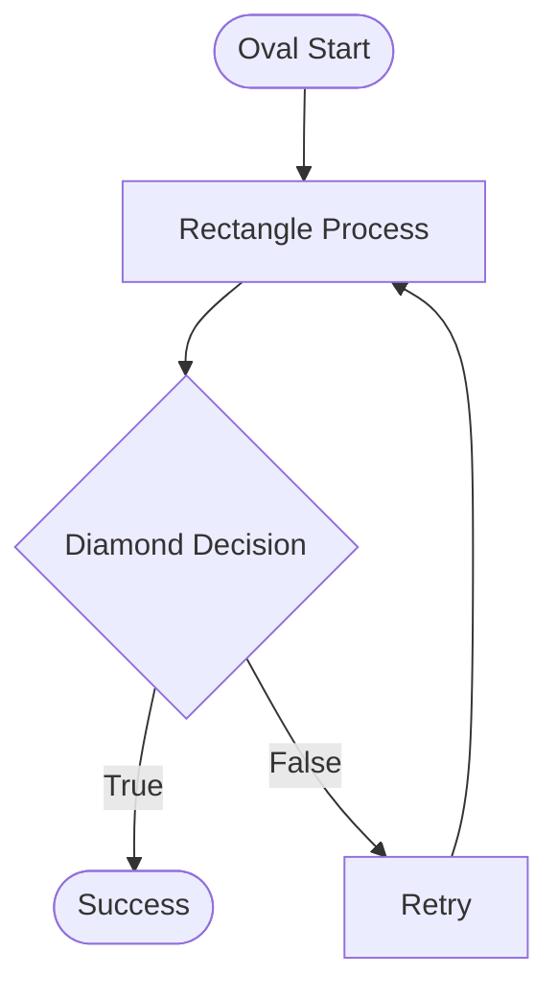
```mermaid
flowchart TD
    Start([Oval Start]) --> Process[Rectangle Process]
    Process --> Decision{Diamond Decision}
    Decision -->|True| Success([Success])
    Decision -->|False| Retry[Retry]
    Retry --> Process
```

---

## 3. Flowchart  All Node Shapes

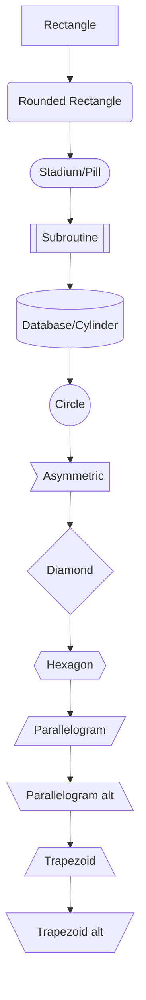
```mermaid
flowchart TD
    A[Rectangle]
    B(Rounded Rectangle)
    C([Stadium/Pill])
    D[[Subroutine]]
    E[(Database/Cylinder)]
    F((Circle))
    G>Asymmetric]
    H{Diamond}
    I{{Hexagon}}
    J[/Parallelogram/]
    K[\Parallelogram alt\]
    L[/Trapezoid\]
    M[\Trapezoid alt/]

    A --> B --> C --> D --> E --> F
    F --> G --> H --> I --> J --> K --> L --> M
```

---

## 4. Flowchart  Edge/Link Styles

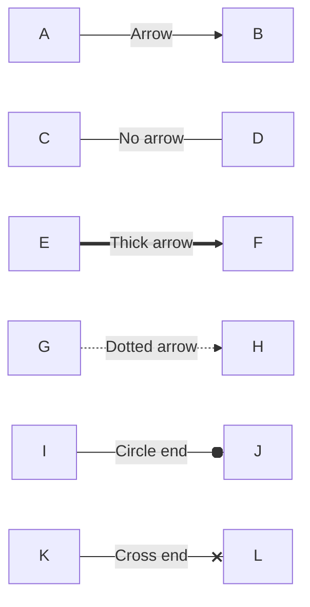
```mermaid
flowchart LR
    A -->|Arrow| B
    C ---| No arrow | D
    E ==>|Thick arrow| F
    G -.->|Dotted arrow| H
    I --o|Circle end| J
    K --x|Cross end| L
```

---

## 5. Flowchart  Subgraphs

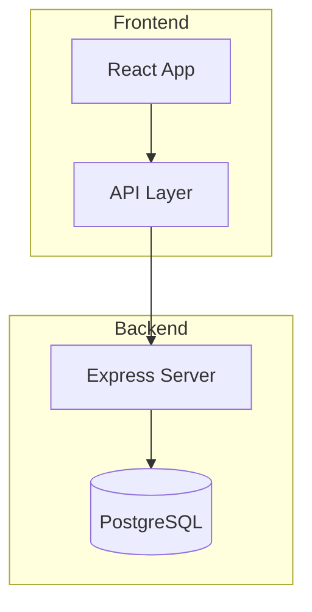
```mermaid
flowchart TB
    subgraph Frontend
        A[React App] --> B[API Layer]
    end
    subgraph Backend
        C[Express Server] --> D[(PostgreSQL)]
    end
    B --> C
```

---

## 6. Flowchart  Nested Subgraphs

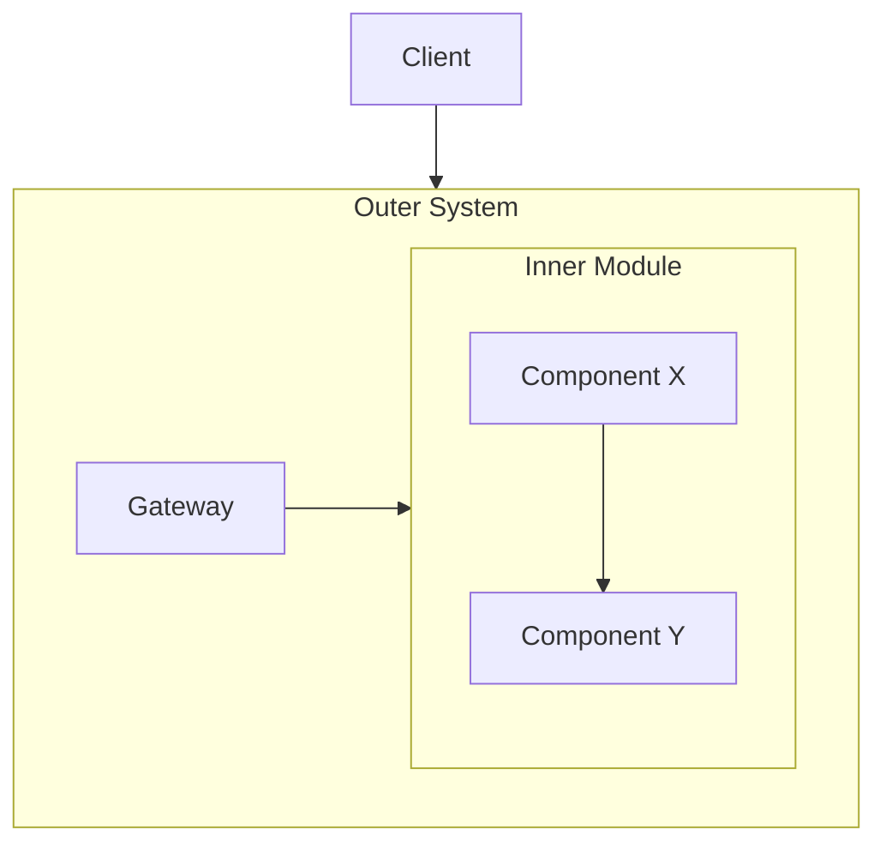
```mermaid
flowchart TB
    subgraph Outer ["Outer System"]
        subgraph Inner ["Inner Module"]
            X[Component X] --> Y[Component Y]
        end
        Z[Gateway] --> Inner
    end
    Client --> Outer
```

---

## 7. Sequence Diagram  Basic

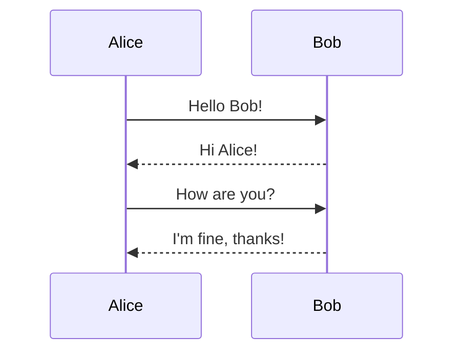
```mermaid
sequenceDiagram
    participant Alice
    participant Bob
    Alice->>Bob: Hello Bob!
    Bob-->>Alice: Hi Alice!
    Alice->>Bob: How are you?
    Bob-->>Alice: I'm fine, thanks!
```

---

## 8. Sequence Diagram  Advanced (loops, alt, notes)

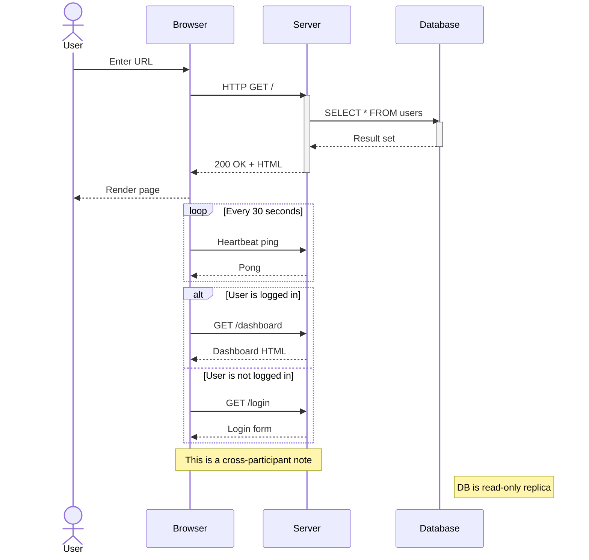
```mermaid
sequenceDiagram
    actor User
    participant Browser
    participant Server
    participant Database

    User->>Browser: Enter URL
    Browser->>Server: HTTP GET /
    activate Server
    Server->>Database: SELECT * FROM users
    activate Database
    Database-->>Server: Result set
    deactivate Database
    Server-->>Browser: 200 OK + HTML
    deactivate Server
    Browser-->>User: Render page

    loop Every 30 seconds
        Browser->>Server: Heartbeat ping
        Server-->>Browser: Pong
    end

    alt User is logged in
        Browser->>Server: GET /dashboard
        Server-->>Browser: Dashboard HTML
    else User is not logged in
        Browser->>Server: GET /login
        Server-->>Browser: Login form
    end

    Note over Browser,Server: This is a cross-participant note
    Note right of Database: DB is read-only replica
```

---

## 9. Class Diagram

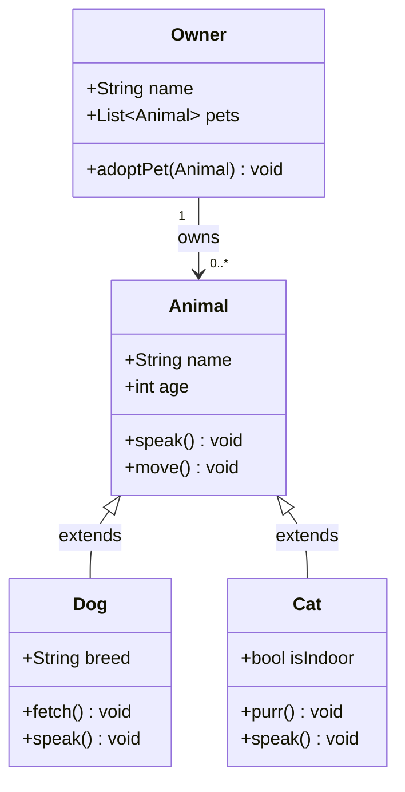
```mermaid
classDiagram
    class Animal {
        +String name
        +int age
        +speak() void
        +move() void
    }

    class Dog {
        +String breed
        +fetch() void
        +speak() void
    }

    class Cat {
        +bool isIndoor
        +purr() void
        +speak() void
    }

    class Owner {
        +String name
        +List~Animal~ pets
        +adoptPet(Animal) void
    }

    Animal <|-- Dog : extends
    Animal <|-- Cat : extends
    Owner "1" --> "0..*" Animal : owns
```

---

## 10. State Diagram (v2)

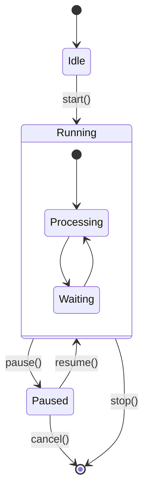
```mermaid
stateDiagram-v2
    [*] --> Idle
    Idle --> Running : start()
    Running --> Paused : pause()
    Paused --> Running : resume()
    Running --> [*] : stop()
    Paused --> [*] : cancel()

    state Running {
        [*] --> Processing
        Processing --> Waiting
        Waiting --> Processing
    }
```

---

## 11. Entity Relationship Diagram (ER)

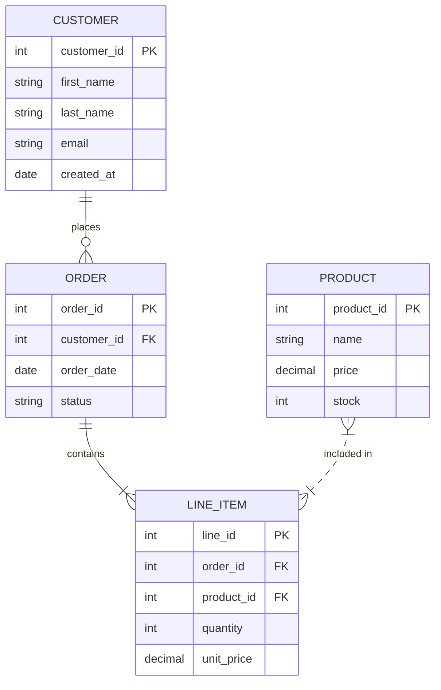
```mermaid
erDiagram
    CUSTOMER ||--o{ ORDER : places
    ORDER ||--|{ LINE_ITEM : contains
    PRODUCT }|..|{ LINE_ITEM : "included in"

    CUSTOMER {
        int customer_id PK
        string first_name
        string last_name
        string email
        date created_at
    }

    ORDER {
        int order_id PK
        int customer_id FK
        date order_date
        string status
    }

    LINE_ITEM {
        int line_id PK
        int order_id FK
        int product_id FK
        int quantity
        decimal unit_price
    }

    PRODUCT {
        int product_id PK
        string name
        decimal price
        int stock
    }
```

---

## 12. Gantt Chart

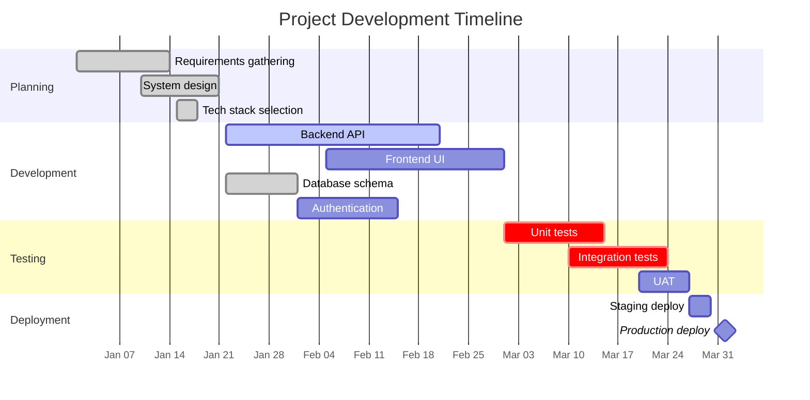
```mermaid
gantt
    title Project Development Timeline
    dateFormat  YYYY-MM-DD
    axisFormat  %b %d

    section Planning
    Requirements gathering    :done,    req,  2024-01-01, 2024-01-14
    System design             :done,    des,  2024-01-10, 2024-01-21
    Tech stack selection      :done,    tec,  2024-01-15, 2024-01-18

    section Development
    Backend API               :active,  api,  2024-01-22, 30d
    Frontend UI               :         ui,   2024-02-05, 25d
    Database schema           :done,    db,   2024-01-22, 10d
    Authentication            :         auth, 2024-02-01, 14d

    section Testing
    Unit tests                :crit,    ut,   2024-03-01, 14d
    Integration tests         :crit,    it,   2024-03-10, 14d
    UAT                       :         uat,  2024-03-20, 7d

    section Deployment
    Staging deploy            :         stg,  2024-03-27, 3d
    Production deploy         :milestone, prod, 2024-04-01, 0d
```

---

## 13. Pie Chart

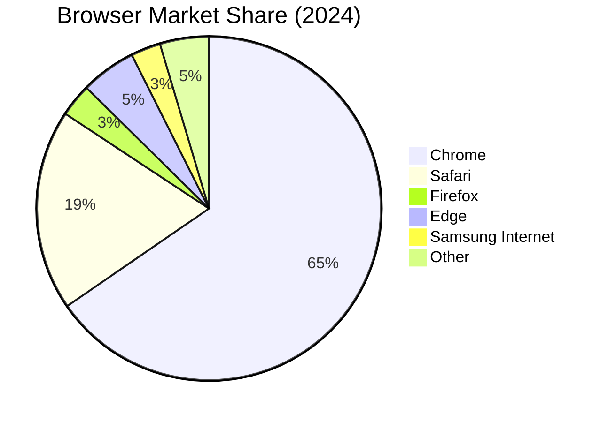
```mermaid
pie title Browser Market Share (2024)
    "Chrome" : 65.4
    "Safari" : 18.9
    "Firefox" : 3.1
    "Edge" : 5.2
    "Samsung Internet" : 2.8
    "Other" : 4.6
```

---

## 14. Git Graph

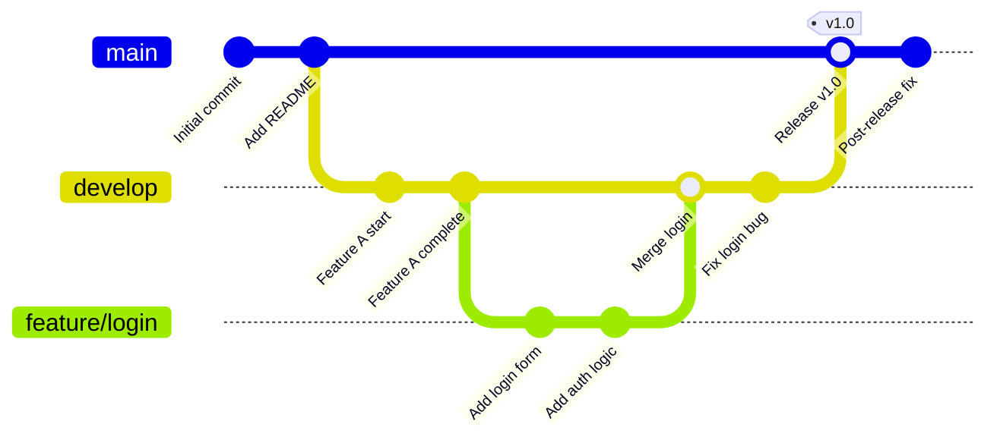
```mermaid
gitGraph
   commit id: "Initial commit"
   commit id: "Add README"
   branch develop
   checkout develop
   commit id: "Feature A start"
   commit id: "Feature A complete"
   branch feature/login
   checkout feature/login
   commit id: "Add login form"
   commit id: "Add auth logic"
   checkout develop
   merge feature/login id: "Merge login"
   commit id: "Fix login bug"
   checkout main
   merge develop id: "Release v1.0" tag: "v1.0"
   commit id: "Post-release fix"
```

---

## 15. Mindmap

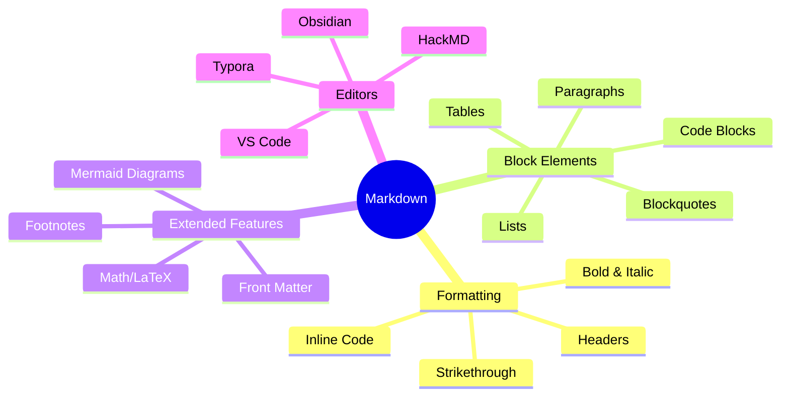
```mermaid
mindmap
  root((Markdown))
    Formatting
      Headers
      Bold & Italic
      Strikethrough
      Inline Code
    Block Elements
      Paragraphs
      Blockquotes
      Code Blocks
      Tables
      Lists
    Extended Features
      Mermaid Diagrams
      Math/LaTeX
      Footnotes
      Front Matter
    Editors
      VS Code
      Obsidian
      Typora
      HackMD
```

---

## 16. Timeline

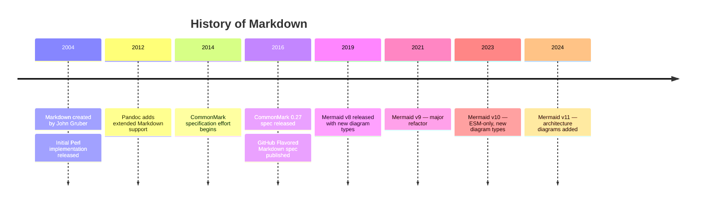
```mermaid
timeline
    title History of Markdown
    2004 : Markdown created by John Gruber
         : Initial Perl implementation released
    2012 : Pandoc adds extended Markdown support
    2014 : CommonMark specification effort begins
    2016 : CommonMark 0.27 spec released
         : GitHub Flavored Markdown spec published
    2019 : Mermaid v8 released with new diagram types
    2021 : Mermaid v9 — major refactor
    2023 : Mermaid v10 — ESM-only, new diagram types
    2024 : Mermaid v11 — architecture diagrams added
```

---

## 17. Requirement Diagram

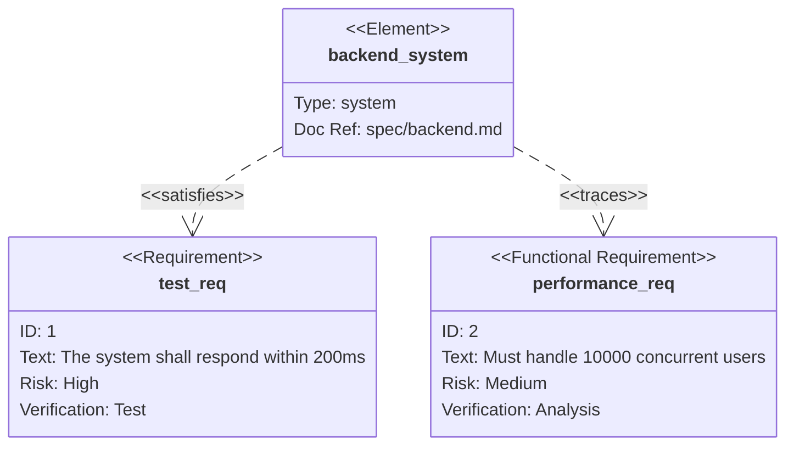
```mermaid
requirementDiagram

    requirement test_req {
        id: 1
        text: The system shall respond within 200ms
        risk: high
        verifymethod: test
    }

    functionalRequirement performance_req {
        id: 2
        text: Must handle 10000 concurrent users
        risk: medium
        verifymethod: analysis
    }

    element backend_system {
        type: system
        docRef: spec/backend.md
    }

    backend_system - satisfies -> test_req
    backend_system - traces -> performance_req
```

---

## 18. Quadrant Chart

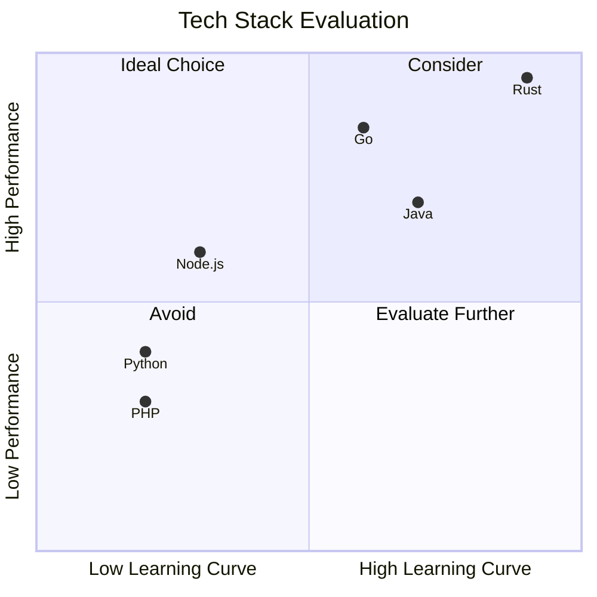
```mermaid
quadrantChart
    title Tech Stack Evaluation
    x-axis Low Learning Curve --> High Learning Curve
    y-axis Low Performance --> High Performance
    quadrant-1 Consider
    quadrant-2 Ideal Choice
    quadrant-3 Avoid
    quadrant-4 Evaluate Further
    Rust: [0.9, 0.95]
    Python: [0.2, 0.4]
    Go: [0.6, 0.85]
    Node.js: [0.3, 0.6]
    Java: [0.7, 0.7]
    PHP: [0.2, 0.3]
```

---

## 19. XY Chart

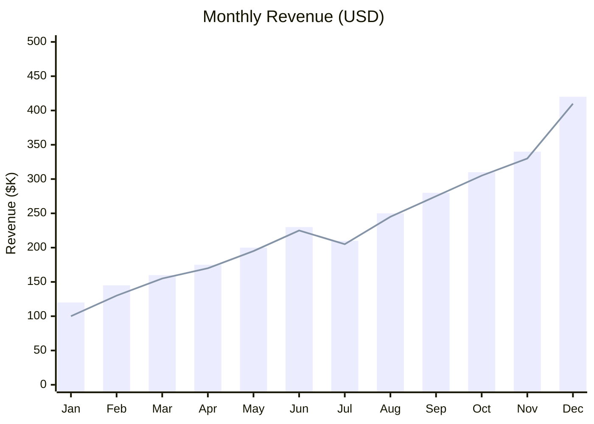
```mermaid
xychart-beta
    title "Monthly Revenue (USD)"
    x-axis [Jan, Feb, Mar, Apr, May, Jun, Jul, Aug, Sep, Oct, Nov, Dec]
    y-axis "Revenue ($K)" 0 --> 500
    bar [120, 145, 160, 175, 200, 230, 210, 250, 280, 310, 340, 420]
    line [100, 130, 155, 170, 195, 225, 205, 245, 275, 305, 330, 410]
```

---

## 20. Block Diagram

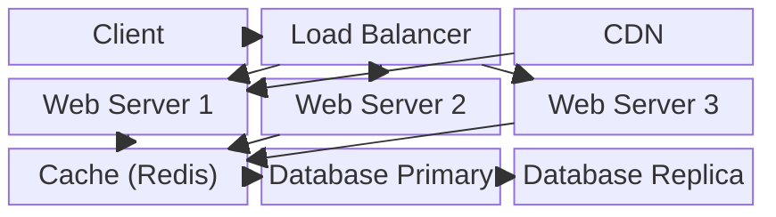
```mermaid
block-beta
    columns 3
    A["Client"] B["Load Balancer"] C["CDN"]
    D["Web Server 1"] E["Web Server 2"] F["Web Server 3"]
    G["Cache (Redis)"] H["Database Primary"] I["Database Replica"]
    A --> B
    B --> D
    B --> E
    B --> F
    D --> G
    E --> G
    F --> G
    G --> H
    H --> I
    C --> D
```

---

## 21. Mermaid  Known Edge Cases & Stress Tests

**Long labels (may overflow):**

```mermaid
flowchart LR
    A["This is a very long label that might overflow the node box in some renderers"] --> B["Short"]
```

**Special characters in labels:**

```mermaid
flowchart TD
    A["Label with (parentheses)"] --> B["Label with [brackets]"]
    B --> C["Label with {braces}"]
    C --> D["Label with 'quotes'"]
    D --> E["Label: colon & ampersand"]
```

**Unicode in labels:**

```mermaid
flowchart LR
    A["日本語ラベル"] --> B["العربية"] --> C["Ελληνικά"] --> D["中文标签"]
```

**Empty diagram (should render blank or error gracefully):**

```mermaid
flowchart TD
```

**Deeply nested subgraph:**

```mermaid
flowchart TB
    subgraph L1["Level 1"]
        subgraph L2["Level 2"]
            subgraph L3["Level 3"]
                X[Deep Node]
            end
        end
    end
    Root --> L1
```
